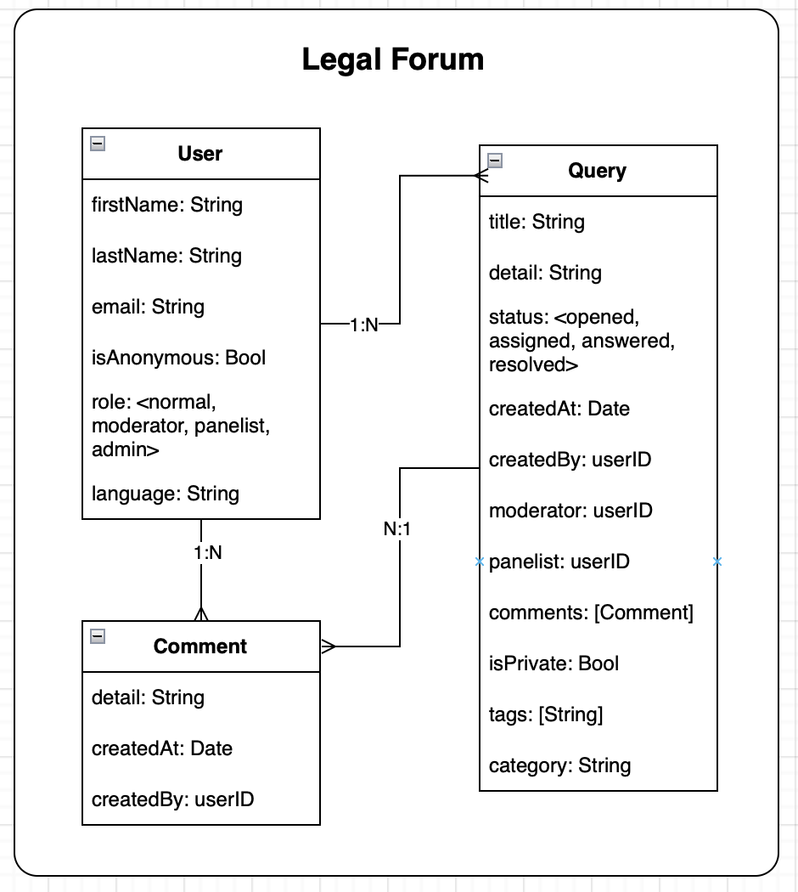

# LegalForum iOS Application

LegalForum is an iOS application designed to facilitate discussions and queries on legal topics. This document provides an overview of the work done in the iOS project, including its architecture, features, and implementation details.

---

## Application Architecture

The LegalForum iOS application is built using **SwiftUI** and follows the **MVVM (Model-View-ViewModel)** architecture pattern. This ensures a clean separation of concerns, making the codebase modular, testable, and easy to maintain.

### Diagram

Below is the high-level architecture diagram of the LegalForum iOS application:

---

## Features Implemented

### 1. **User Authentication**
- **Sign Up**: Users can create an account by providing their details, including name, email, password, and role.
- **Sign In**: Users can log in using their email and password.
- **Logout**: Users can securely log out of the application.

### 2. **Query Management**
- **Create Query**: Users can create a query by providing a title, details, category, and privacy settings.
- **Search Queries**: Users can search for queries using keywords.
- **View Query Details**: Users can view detailed information about a query, including its comments and status.
- **Assign Panelist**: Moderators can assign a panelist to a query.
- **Answer Query**: Panelists can provide answers to queries.

### 3. **Role-Based Access**
- **Normal User**: Can create and view public queries.
- **Moderator**: Can assign panelists to queries.
- **Panelist**: Can answer queries assigned to them.

### 4. **Validation**
- Email and password validation is implemented to ensure proper input during sign-up and login.

---

## Code Structure

The project is organized into the following directories:

### 1. **Clients**
Contains the `HTTPClient` responsible for making network requests to the backend server.

- **File**: `HTTPClient.swift`
- **Key Responsibilities**:
  - Handles HTTP requests (GET, POST, PUT, DELETE).
  - Decodes responses into Swift models.
  - Manages errors such as invalid responses and decoding failures.

### 2. **Models**
Defines the data structures used throughout the application.

- **Files**:
  - `User.swift`: Represents user-related data.
  - `Query.swift`: Represents query-related data.
  - `Comment.swift`: Represents comments on queries.

### 3. **Stores**
Manages application state and business logic.

- **Files**:
  - `UserStore.swift`: Handles user authentication, signup, and user-related operations.
  - `QueryStore.swift`: Manages queries, including creation, assignment, and answering.

### 4. **Utils**
Contains utility classes and constants.

- **Files**:
  - `Constants.swift`: Defines API endpoints, headers, and keys.
  - `Validations.swift`: Provides email and password validation logic.

### 5. **Views**
Contains all SwiftUI views for the user interface.

- **Files**:
  - `SignInView.swift`: Login screen.
  - `SignUpView.swift`: Registration screen.
  - `QuerySearchView.swift`: Displays a list of queries with search functionality.
  - `QueryDetailView.swift`: Shows detailed information about a query.
  - `CreateQueryView.swift`: Allows users to create a new query.
  - `AssignQueryView.swift`: Enables moderators to assign panelists to a query.
  - `AddAnswerView.swift`: Allows panelists to answer a query.

---

## Key Highlights

### 1. **State Management**
The application uses `@StateObject` and `@Environment` for managing state across views. This ensures a reactive UI that updates automatically when the state changes.

### 2. **Asynchronous Networking**
The app leverages Swift's `async/await` for making asynchronous network calls, ensuring a smooth user experience.

### 3. **Error Handling**
Comprehensive error handling is implemented for network requests and user input validation.

### 4. **Reusable Components**
The project includes reusable components such as forms, buttons, and pickers to maintain consistency across the app.

---

## How to Run the Project

1. Open the `LegalForum-iOS` folder in Xcode.
2. Select the `LegalForum` scheme.
3. Build and run the project on a simulator or a physical device.

---

## Future Enhancements

1. **Push Notifications**: Notify users about updates to their queries.
2. **Offline Mode**: Cache queries locally for offline access.
3. **Unit Tests**: Add more comprehensive unit tests for stores and views.

---

## Backend Integration

The iOS application communicates with the backend server hosted at `http://localhost:3001`. The backend provides APIs for user authentication, query management, and role-based access control.

---

## Conclusion

The LegalForum iOS application provides a robust platform for users to engage in legal discussions. Its modular architecture and clean codebase make it easy to extend and maintain.